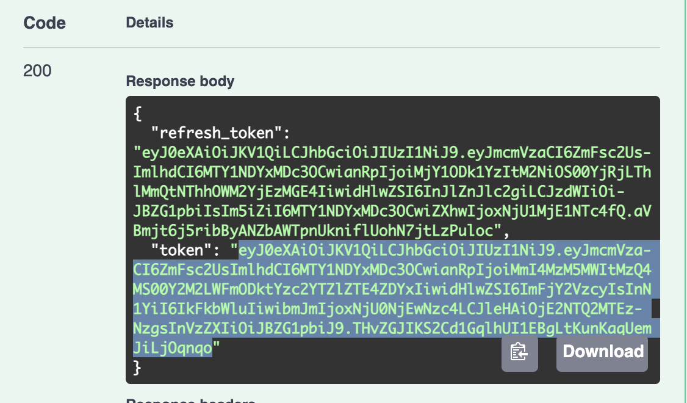

# How to create a development cluster
## Deploy a Root Orchestrator 

On a Linux machine with public IP address or DNS name, first install Docker and Docker-compose. Then, run the following commands to set up the Root Orchestrator components. 

```bash
cd root_orchestrator/
docker-compose up --build 
```

The following ports are exposed:

- Port 80 - Grafana Dashboard (It can be used to monitor the clsuter status)
- Port 10000 - System Manager (It needs to be accessible from the Cluster Orchestrator)


## Deploy one or more Cluster Orchestrator(s)

For each one of the cluster orchestrator that needs to be deployed 

- Log into a Linux machine with public IP address or DNS name
- Install Docker and Docker-compose.
- Export the required parameters:

```
export SYSTEM_MANAGER_URL=" < ip address of the root orchestrator > "
export CLUSTER_NAME=" < name of the cluster > "
export CLUSTER_LOCATION=" < location of the cluster > "
```

- Then, run the following commands to set up the Cluster Orchestrator components. 

```bash
cd cluster_orchestrator/
docker-compose up --build 
```

The following ports are exposed:

- 10100 Cluster Manager (needs to be accessible by the Node Engine)

## Add worker nodes (run Node Engine)

*Requirements*
- Linux OS with the following packages installed (Ubuntu and many other distributions natively supports them)
  - iptable
  - ip utils
- port 50103 available

1) First you need to install the go Node Engine.
```
wget -c https://github.com/oakestra/oakestra/releases/download/v0.4.2/NodeEngine_$(dpkg --print-architecture).tar.gz && tar -xzf NodeEngine_$(dpkg --print-architecture).tar.gz && chmod +x install.sh && ./install.sh
```
2) (Optional, required only if you want to enable communication across the microservices) Install the [OakestraNet/Node_net_manager](https://github.com/oakestra/oakestra-net/tree/main/node-net-manager) component using the following commsnd:
```
wget -c https://github.com/oakestra/oakestra-net/releases/download/v0.4.2/NetManager_$(dpkg --print-architecture).tar.gz && tar -xzf NetManager_$(dpkg --print-architecture).tar.gz && chmod +x install.sh && ./install.sh $(dpkg --print-architecture)
```
2.1) Configure the NetManager config file accordingly to what stated in the [NetManager Readme](https://github.com/oakestra/oakestra-net/blob/main/node-net-manager/README.md). Leave the ClusterMqttPort value to the default 10003 value.  
2.2) Run the NetManager using `sudo NetManager -p 6000`
3) Run the node engine: `sudo NodeEngine -a <cluster orchestrator address> -p <cluster orhcestrator port e.g. 10100> -n 6000`. If you specifcy the flag `-n 6000`, the NodeEngine expects a running NetManager component on port 6000. If this is the case, the node will start in overlay mode, enabling the networking across the deployed application. In order to do so, you need to have the Oakestra NetManager component installed on your worker node ([OakestraNet/Node_net_manager](https://github.com/oakestra/oakestra-net/tree/main/node-net-manager)). If you don't which to enable the networking, simply avoid specifying the flag -n. Use NodeEngine -h for further details
3.1) As an alternative you can run the development version of the NodeEngine moving inside `go_node_engine` and running `sudo go NodeEngine -a <cluster orchestrator address> -p <cluster orhcestrator port e.g. 10100> -n <net manager port>`

# Use the APIs to deploy a new application

## Deployment descriptor

In order to deploy a container a deployment descriptor must be passed to the deployment command. 
The deployment descriptor contains all the information that Oakestra needs in order to achieve a complete
deploy in the system. 

Since version 0.4, Oakestra (previously, EdgeIO) uses the following deployment descriptor format. 

`deploy_curl_application.yaml`

```yaml
{
  "sla_version" : "v2.0",
  "customerID" : "Admin",
  "applications" : [
    {
      "applicationID" : "",
      "application_name" : "clientsrvr",
      "application_namespace" : "test",
      "application_desc" : "Simple demo with curl client and Nginx server",
      "microservices" : [
        {
          "microserviceID": "",
          "microservice_name": "curl",
          "microservice_namespace": "test",
          "virtualization": "container",
          "cmd": ["sh", "-c", "tail -f /dev/null"],
          "memory": 100,
          "vcpus": 1,
          "vgpus": 0,
          "vtpus": 0,
          "bandwidth_in": 0,
          "bandwidth_out": 0,
          "storage": 0,
          "code": "docker.io/curlimages/curl:7.82.0",
          "state": "",
          "port": "9080",
          "added_files": []
        },
        {
          "microserviceID": "",
          "microservice_name": "nginx",
          "microservice_namespace": "test",
          "virtualization": "container",
          "cmd": [],
          "memory": 100,
          "vcpus": 1,
          "vgpus": 0,
          "vtpus": 0,
          "bandwidth_in": 0,
          "bandwidth_out": 0,
          "storage": 0,
          "code": "docker.io/library/nginx:latest",
          "state": "",
          "port": "6080:60/tcp",
          "addresses": {
            "rr_ip": "10.30.30.30"
          },
          "added_files": []
        }
      ]
    }
  ]
}
```

This deployment descriptor example generates one application named *clientserver* with the `test` namespace and two microservices:
- nginx server with test namespace, namely `clientserver.test.nginx.test`
- curl client with test namespace, namely `clientserver.test.curl.test`

This is a detailed description of the deployment descriptor fields currently implemented:
- sla_version: the current version is v0.2
- customerID: id of the user, default is Admin
  - application list, in a single deployment descriptor is possible to define multiple applications, each containing:
    - Fully qualified app name: A fully qualified name in Oakestra is composed of 
        - application_name: unique name representing the application (max 10 char, no symbols)
        - application_namespace: namespace of the app, used to reference different deployment of the same application. Examples of namespace name can be `default` or `production` or `test` (max 10 char, no symbols)
        - applicationID: leave it empty for new deployments, this is needed only to edit an existing deployment.  
    - application_desc: Short description of the application
    - microservice list, a list of the microservices composing the application. For each microservice the user can specify:
      - microserviceID: leave it empty for new deployments, this is needed only to edit an existing deployment.
      - Fully qualified service name:
        - microservice_name: name of the service (max 10 char, no symbols)
        - microservice_namespace: namespace of the service, used to reference different deployment of the same service. Examples of namespace name can be `default` or `production` or `test` (max 10 char, no symbols)
      - virtualization: currently the only uspported virtualization is `container`
      - cmd: list of the commands to be executed inside the container at startup
      - vcpu,vgpu,memory: minimum cpu/gpu vcores and memory amount needed to run the container
      - vtpus: currently not implemented
      - storage: minimum storage size required (currently the scheduler does not take this value into account)
      - bandwidth_in/out: minimum required bandwith on the worker node. (currently the scheduler does not take this value into account)
      - port: port mapping for the container in the syntax hostport_1:containerport_1\[/protocol];hostport_2:containerport_2\[/protocol] (default protocol is tcp)
      - addresses: allows to specify a custom ip address to be used to balance the traffic across all the service instances. 
        - rr\_ip: [optional filed] This field allows you to setup a custom Round Robin network address to reference all the instances belonging to this service. This address is going to be permanently bounded to the service. The address MUST be in the form `10.30.x.y` and must not collide with any other Instance Address or Service IP in the system, otherwise an error will be returned. If you don't specify a RR_ip and you don't set this field, a new address will be generated by the system.
      - constraints: array of constraints regarding the service. 
        - type: constraint type
          - `direct`: Send a deployment to a specific cluster and a specific list of eligible nodes. You can specify `"node":"node1;node2;...;noden"` a list of node's hostnames. These are the only eligible worker nodes.  `"cluster":"cluster_name"` The name of the cluster where this service must be scheduled. E.g.:
         
    ```
    "constraints":[
                {
                  "type":"direct",
                  "node":"xavier1",
                  "cluster":"gpu"
                }
              ]
    ```
 
## Login
After running a cluster you can use the debug OpenAPI page to interact with the apis and use the infrastructure

connect to `<root_orch_ip>:10000/api/docs`

Authenticate using the following procedure:

1. locate the login method and use the try-out button

2. Use the default Admin credentials to login

3. Copy the result login token

4. Go to the top of the page and authenticate with this token


## Register an application and the services
After you authenticate with the login function, you can try out to deploy the first application. 

1. Upload the deployment description to the system. You can try using the deployment descriptor above.


The response contains the Application id and the id for all the application's services. Now the application and the services are registered to the platform. It's time to deploy the service instances! 

You can always remove or create a new service for the application using the /api/services endpoints

## Deploy an instance of a registered service 

1. Trigger a deployment of a service's instance using `POST /api/service/{serviceid}/instance`

each call to this endpoint generates a new instance of the service

## Monitor the service status

1. With `GET /api/aplications/<userid>` (or simply /api/aplications/ if you're admin) you can check the list of the deployed application.
2. With `GET /api/services/<appid>` you can check the services attached to an application
3. With `GET /api/service/<serviceid>` you can check the status for all the instances of <serviceid>

## Undeploy 

- Use `DELETE /api/service/<serviceid>` to delete all the instances of a service
- Use `DELETE /api/service/<serviceid>/instance/<instance number>` to delete a specific instance of a service
- Use `DELETE /api/application/<appid>` to delete all together an application with all the services and instances

# Networking 

To enable the communication between services: 

1. ensure that each worker node has the [OakestraNet/Node_net_manager](https://github.com/oakestra/oakestra-net/tree/main/node-net-manager) component installed, up and running before running the node engine. 
2. Declare a rr_ip ad deploy time in the deployment descriptor 
3. Use the rr_ip address to reference the service

# Frontend?

To make your life easire you can run the Oakestra front-end.
Check the [Dashboard](https://github.com/oakestra/dashboard) repository for further info.
